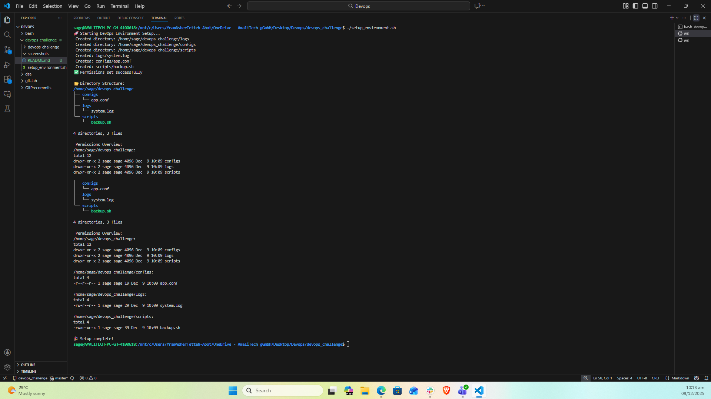
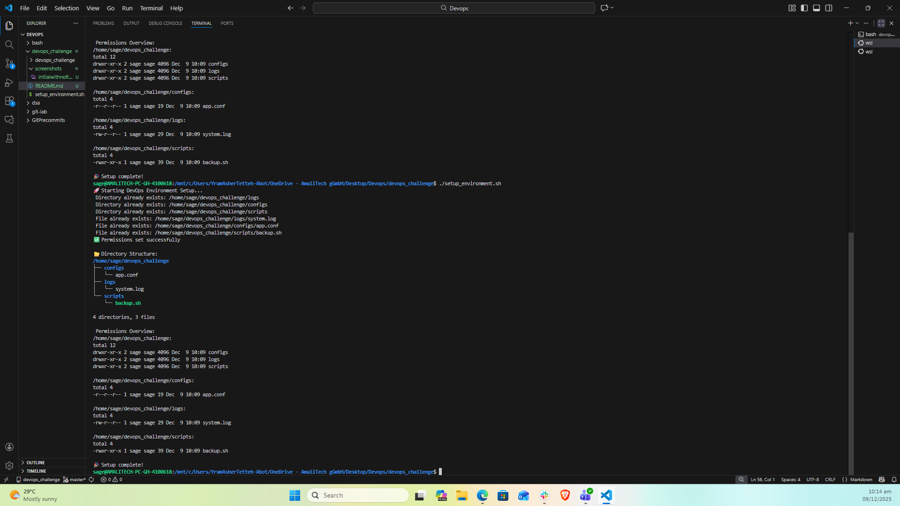

# SysAdmin Starter Pack (Mini-Challenge)

This repository contains a Bash script that automates common Linux administrative tasks, including file management, directory organization, and permission settings.

---

## 📝 Challenge Overview

**Goal:** Automate setup of a basic folder structure for storing project logs, configuration files, and scripts.  

**Learning Objectives:**
- Execute common Linux commands to navigate and manage the filesystem.
- Create and manage files and directories using Bash commands.
- Modify file permissions and ownership using `chmod`.

---

## ⚙️ Script: `setup_environment.sh`

This script performs the following:

1. Creates directories: `logs/`, `configs/`, `scripts/`
2. Creates files:
   - `logs/system.log`
   - `configs/app.conf`
   - `scripts/backup.sh`
3. Adds sample content to each file.
4. Sets permissions:
   - `logs/system.log` → `644`
   - `configs/app.conf` → `444`
   - `scripts/backup.sh` → `755`
5. Displays directory structure (`tree`) and permissions (`ls -lR`)
6. Handles existing directories or files gracefully.

---

## 💻 Screenshots

### 1. Directory Structure and Permissions when files don't already exists:

### 2. Directory Structure and Permissions when files exists:

---

